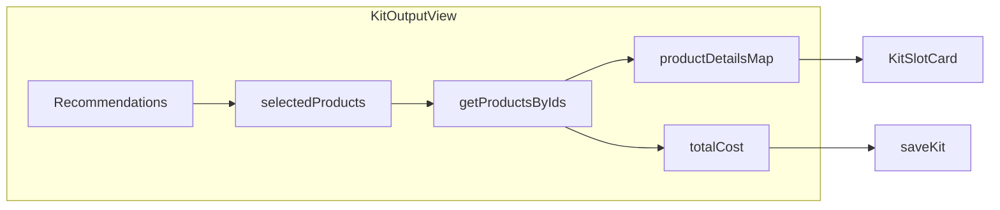

# Off-Pavement Shop: Next Steps Implementation Plan

## Current State Summary

**Implemented:** Phase 1-6 (Docker, Medusa, ProductEditorial, Kit Builder, PDP+Sanity, Meilisearch), homepage branding, Add all to cart, Share, Saved kits page, SharedKitView with product names + per-item Add to cart.

**Gaps from plan:**

- Kit Output: total cost is always 0; slot cards lack images and prices
- No Sanity Studio (productBrief schema exists but no editing UI)
- No `/guides` editorial pages
- Anonymous kits not linked to customer on login
- Country selector shows single US option (optional hide)

---

## Phase A: Kit Builder Polish

### A.1 Total Cost Calculation

**Problem:** [kit-output-view.tsx](apps/storefront/src/modules/kit-builder/components/kit-output-view.tsx) passes `total_cost: 0` to save.

**Solution:** Fetch product prices for selected items from Medusa (region-dependent). Options:

- **Option A:** Extend `POST /store/kit-builder/recommendations` to optionally return `calculated_price` per product (requires region_id in request, pricing module lookup).
- **Option B:** Frontend: after recommendations load, call Medusa `listProducts` with `id: [selectedIds]` and `region_id` to get priced variants; derive `totalCost` from `variants[0].calculated_price.amount`; pass to save.

**Recommendation:** Option B — no backend changes; reuse existing [getProductsByIds](apps/storefront/src/lib/data/products.ts) pattern. Add a `useEffect` or second fetch in `KitOutputView` that fetches priced products for `selectedProducts` (excluding owned), sums amounts, stores in state, passes to `saveKit`.

**Files:** [kit-output-view.tsx](apps/storefront/src/modules/kit-builder/components/kit-output-view.tsx)

### A.2 Product Images and Prices in Slot Cards

**Problem:** [kit-slot-card.tsx](apps/storefront/src/modules/kit-builder/components/kit-slot-card.tsx) shows title and weight only; plan specifies "Image, name, weight, price".

**Solution:** Extend recommendations API or frontend fetch to include:

- `thumbnail` (product thumbnail URL)
- `calculated_price` (amount in cents, currency)

**Approach:** The recommendations route uses `productService.listProducts`; Product typically has `thumbnail` when fetched with relations. The kit builder recommendations map from `p.metadata` for weight, etc. — they don't currently include `thumbnail` or pricing. Pricing requires region. Two approaches:

1. **Backend:** Add optional `region_id` to recommendations request; join pricing in Medusa and return `thumbnail`, `price_amount`, `currency_code` per product.
2. **Frontend:** After recommendations, fetch full products (with variants and calculated_price) for the selected product IDs via `getProductsByIds`; pass a `productDetails` map `{ productId: { thumbnail, price } }` into `KitSlotCard`.

**Recommendation:** Frontend approach — `getProductsByIds` already returns products with variants and `calculated_price` when used with `countryCode`. Reuse that fetch (same one for total cost) and pass `productDetails` to `KitSlotCard`. Update `KitSlotCard` to accept optional `thumbnail` and `price` and render them.

**Files:**

- [kit-output-view.tsx](apps/storefront/src/modules/kit-builder/components/kit-output-view.tsx) — fetch product details, build map, pass to cards
- [kit-slot-card.tsx](apps/storefront/src/modules/kit-builder/components/kit-slot-card.tsx) — add thumbnail image, formatted price

---

## Phase B: Sanity Studio

### B.1 Create Sanity Studio App

**Current:** [apps/storefront/src/sanity/schemas/productBrief.ts](apps/storefront/src/sanity/schemas/productBrief.ts) exists; README says run `pnpm create sanity@latest` in e.g. `apps/sanity-studio`.

**Tasks:**

1. Run `pnpm create sanity@latest` in `apps/sanity-studio` (or similar).
2. Copy `productBrief` schema from [productBrief.ts](apps/storefront/src/sanity/schemas/productBrief.ts) into the studio's schema types.
3. Add `teamMember` schema if productBrief references it (tester field).
4. Configure `sanity.config.ts` to use the same project ID/dataset as the storefront (from env).
5. Add dev script: `pnpm dev:studio` or include in root `pnpm dev` for local content editing.

**Output:** Content editors can create/edit Product Brief documents linked to Medusa product IDs.

---

## Phase C: Guides Pages

### C.1 Sanity Guide Schema

Create a `guide` document type in Sanity (in `apps/sanity-studio` or shared schemas):

- `slug` (slug)
- `title`, `description`, `publishedAt`
- `content` (blockContent / Portable Text)
- Optional: `featured`, `category`

### C.2 Storefront Guides Pages

**Routes:**

- `/[countryCode]/(main)/guides/page.tsx` — list guides (fetch from Sanity)
- `/[countryCode]/(main)/guides/[slug]/page.tsx` — single guide

**Implementation:**

- Add `getGuides()` and `getGuideBySlug(slug)` in [lib/sanity.ts](apps/storefront/src/lib/sanity.ts) or a new `lib/guides.ts`.
- Use `@portabletext/react` to render block content.
- Add "Guides" link to nav (e.g. in [nav/index.tsx](apps/storefront/src/modules/layout/templates/nav/index.tsx) or side menu).

---

## Phase D: Anonymous Kit Linking

### D.1 Link Session Kits to Customer on Login

**Problem:** Kits saved with `session_id` (anonymous) don't appear in Account > Saved Kits after login, because the API returns `listKitsByCustomer` when logged in.

**Solution:** When a customer logs in (or registers), run a one-time migration: find all SavedKits with `session_id = current kit_session cookie` and update them to set `customer_id = authenticated customer` and `session_id = null`.

**Implementation options:**

1. **Auth subscriber:** Medusa/Better Auth may emit `customer.created` or `auth.session.created`. Subscribe and run update.
2. **Custom middleware/route:** On successful login in the storefront, call a new Medusa endpoint e.g. `POST /store/kit-builder/link-session` that accepts the session cookie, looks up kits by `session_id`, updates `customer_id`. Storefront calls this after login.
3. **GET /store/kit-builder enhancement:** When returning kits, if customer is authenticated and request has `kit_session` cookie, merge: return customer kits + session kits, then optionally trigger a background link. Simpler but requires careful implementation.

**Recommendation:** Option 2 — add `POST /store/kit-builder/link-session` in [packages/medusa/src/api/store/kit-builder/](packages/medusa/src/api/store/kit-builder/). Body/cookie: `kit_session`. Logic: update all SavedKits with that `session_id` to set `customer_id` from auth, clear `session_id`. Call from storefront after successful login (in [customer.ts](apps/storefront/src/lib/data/customer.ts) login flow or in the component that handles post-login redirect).

**Files:**

- New: [packages/medusa/src/api/store/kit-builder/link-session/route.ts](packages/medusa/src/api/store/kit-builder/link-session/route.ts)
- [packages/medusa/src/modules/kit-builder/service.ts](packages/medusa/src/modules/kit-builder/service.ts) — add `linkSessionToCustomer(sessionId, customerId)`
- [apps/storefront/src/lib/data/customer.ts](apps/storefront/src/lib/data/customer.ts) or login component — call link-session after login
- [apps/storefront/src/lib/medusa-client.ts](apps/storefront/src/lib/medusa-client.ts) — add `linkKitSession()` fetch

---

## Phase E: Optional UX

### E.1 Hide Country Selector for Single Region

In [side-menu/index.tsx](apps/storefront/src/modules/layout/components/side-menu/index.tsx) (or wherever CountrySelect lives), conditionally hide when `regions?.length === 1` or when the flattened country list has one item. Small change.

---

## Implementation Order

| Phase | Deliverable                                            |
| ----- | ------------------------------------------------------ |
| A     | Kit Builder: total cost, images + prices in slot cards |
| B     | Sanity Studio for productBrief editing                 |
| C     | Guides schema + /guides, /guides/[slug] pages          |
| D     | Anonymous kit linking on login                         |
| E     | Hide country selector when single region (optional)    |

---

## Data Flow: Kit Builder Total Cost + Product Details

---

## Key Files Reference

| Area            | Files                                                                                                                                                                                    |
| --------------- | ---------------------------------------------------------------------------------------------------------------------------------------------------------------------------------------- |
| Kit Output      | [kit-output-view.tsx](apps/storefront/src/modules/kit-builder/components/kit-output-view.tsx), [kit-slot-card.tsx](apps/storefront/src/modules/kit-builder/components/kit-slot-card.tsx) |
| Products        | [products.ts](apps/storefront/src/lib/data/products.ts)                                                                                                                                  |
| Sanity          | [sanity.ts](apps/storefront/src/lib/sanity.ts), [productBrief.ts](apps/storefront/src/sanity/schemas/productBrief.ts)                                                                    |
| Kit Builder API | [packages/medusa/src/api/store/kit-builder/](packages/medusa/src/api/store/kit-builder/), [service.ts](packages/medusa/src/modules/kit-builder/service.ts)                               |
| Auth/Customer   | [customer.ts](apps/storefront/src/lib/data/customer.ts)                                                                                                                                  |

